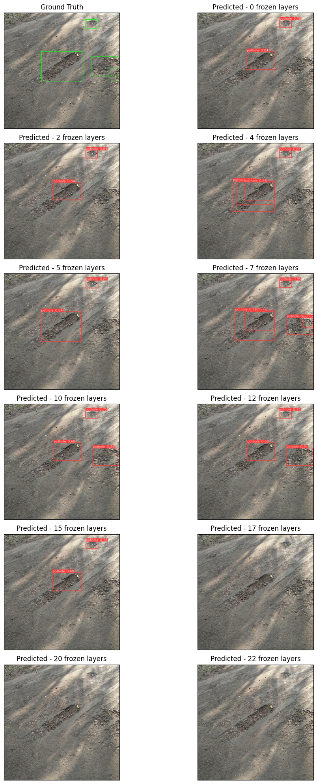

# YOLOv8 Fine-tuning for Pothole Detection with Variable Frozen Layers
---------------------------------------------------

This repository contains code for fine-tuning YOLOv8 on a pothole dataset sourced from [roboflow.com](https://public.roboflow.com/object-detection/pothole).
The fine-tuning process involves downloading the dataset, training the YOLOv8 model, validating its performance, visualizing training curves, and making predictions on test data.

[](Pothole_Video/pothole_1.mp4)

<video src="Pothole_Video/pothole_1.mp4"></video>


## Getting Started

### Prerequisites

Ensure you have the following dependencies installed:

- Python (>=3.6)
- PyTorch (>=1.7.0)

Install additional dependencies by running:

```bash
pip install -r requirements.txt
```

### Dataset

Download the pothole dataset from [roboflow.com](https://public.roboflow.com/object-detection/pothole) and organize it into the desired directory structure.
```bash
!curl -L "https://public.roboflow.com/ds/YOUR_API_KEY" > roboflow.zip
!unzip -o roboflow.zip
!rm roboflow.zip
```


### Training

Run the training script to fine-tune the YOLOv8 model on the drone dataset:

```bash
for n_frozen in NUMBER_OF_FROZEN_LAYERS:
    #-- load YOLO model --
    model = YOLO("yolov8m.pt") 
    
    train_model(model = model,
                number_of_frozen_layers = n_frozen,
                num_of_epochs = NUM_EPOCHS)

```


### Validation

Validate the model on the validation set:

```bash
for n_frozen in NUMBER_OF_FROZEN_LAYERS:
    
    #-- load best model --
    best_model_file = output_path + 'model_' + str(n_frozen) + '_frozen' + '/train/weights/best.pt'
    best_model = YOLO(best_model_file)     
    
    val_model(model= best_model,
              NUMBER_OF_FROZEN_LAYERS = n_frozen)
```

### Inference

Make predictions on test data and visualize the results:

```bash
for n_frozen in NUMBER_OF_FROZEN_LAYERS:   
    
    #-- load best model --
    best_model_file = output_path + 'model_' + str(n_frozen) + '_frozen' + '/train/weights/best.pt'
    best_model = YOLO(best_model_file)       
    
    #-- get conf and iou for best map_50 --
    max_conf = best_results[n_frozen][0]
    max_iou = best_results[n_frozen][1]
    
    #-- set project and name for creating result dir --
    project_value = 'model_' + str(n_frozen) + '_frozen/predictions'   
    name_value = 'predictions_' + str(max_conf) + '_' + str(max_iou)      
      
    best_model.predict(source = test_img_dir,
                       conf = max_conf,
                       iou = max_iou,
                       show = False,
                       save= True,
                       project= project_value,
                       name=name_value) 
```


## Contributing

Feel free to contribute by opening issues or pull requests.
